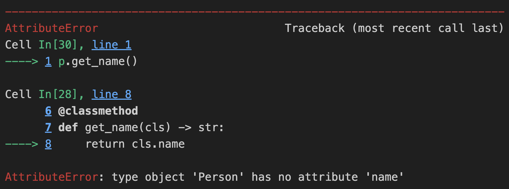

# dataclass

`dataclass` 是 Python 3.7 引入的一个装饰器，用于简化类的定义。

使用 dataclass 可以自动生成一些常用方法，比如 `__init__`、`__repr__`、`__eq__` 等等。这些方法均无需手动实现，除非有定制化需求。

本文介绍 dataclass 的用法，同时也介绍了相关面向对象的一些属性和方法，包括：

1. 如何判断 实例属性和类属性；
2. 对比分析 实例方法、静态方法（`@staticmethod`）和 类方法（`@classmethod`）

## 实例属性和类属性

使用 dataclass 定义一个类非常简单，只需要在类定义前加上 @dataclass 装饰器，并在类中定义属性即可。

```python
@dataclass
class Person:
    home = "Wuhan"
    name : str
```

> **类属性 **是定义在类体中，在任何方法之外（包括`__init__`方法）的变量。它们属于类本身，而不是类的实例。类属性在内存中只有一个副本，无论创建了多少个类的实例，这个副本都是共享的。

在上述的代码中，`home`就是一个类属性。它被定义在类体中，在任何方法之外，且没有与实例变量相同的类型注解。由于`home`被定义为一个字符串，它将作为`Person`类的一个共享属性。所有`Person`类的实例都将访问到同一个`home`属性的值。

>  **实例属性** 是定义在类的`__init__`方法或其他实例方法中的变量。它们属于类的实例，每个实例都有自己的实例属性副本。实例属性通常通过类型注解来指定其期望的数据类型，并使用`self`参数来引用实例本身。

在上述代码中，`name`被声明为一个类型注解为`str`的变量，虽然其没有在`__init__`方法内部被初始化。由于使用了`@dataclass`装饰器，`dataclasses`模块会自动生成`__init__`方法，该方法将接受与类型注解相匹配的参数，并将它们设置为实例属性。因此，尽管没有明确写出`__init__`方法，但`name`仍然是一个实例属性。

故在创建一个`Person`类的实例时，需要提供一个`name`值，该值将被设置为该实例的`name`属性。由于`name`是一个实例属性，每个`Person`实例都将有自己的`name`属性副本。只需要给实例属性 `name` 传参，无需给类属性`home`传参。

```python
p1 = Person("Alice")
p1 = Person("Bob")
print(p1.name, p1.home)
print(p2.name, p2.home)
```
Output:

```python
Alice Wuhan
Bob Wuhan
```

由于`home`是类属性，故对其进行修改后，`p1.home`和`p2.home`会变成同一个值。

```python
Person.home = "Fuzhou"
print(p1.home, p2.home)
```

Output:

```python
Fuzhou Fuzhou
```


### 自动设置属性

在初始化某些类别的时候，某些属性，可以通过传入的属性，推测与计算出来。

在 `dataclass` 中，实例变量是在 `__init__` 方法中初始化的属性。可以使用 `field` 函数并指定 `init=False`，表示这个字段不在 `__init__` 方法中进行初始化。

以下述代码为例，根据输入的年龄 age，添加是否成年( is_adult) 的属性。`__post_init__ `在`__init__`之后运行，在其中实现为Person 实例，添加 is_adult 的属性。

在下面的例子中，is_adult 的默认值是 False，并且不会在 `__init__` 方法中初始化。通过定义一个 `__post_init__` 方法，对 is_adult进行赋值。

```python
@dataclass
class Person:
    name : str
    age: int
    is_adult: bool = field(init=False, default=False)
    
    def __post_init__(self):
        if self.age >= 18:
            self.is_adult = True
        else:
            self.is_adult = False
```


```python
p1 = Person("Alice", 25)
p2 = Person("Bob", 17)
print(p1)
print(p2)
```

Output:

```python
Person(name='Alice', age=25, is_adult=True)
Person(name='Bob', age=17, is_adult=False)
```

如结果所示，实现自动根据 age，为Person 实例，添加 is_adult 属性。


## 实例方法

在面向对象编程（Object-Oriented Programming, OOP）的术语中，一个实例方法 能够访问和改变对象状态。

```python
@dataclass
class Person:
    name : str
    age: int
    
    def grow_up(self):
        self.age += 1
```

 `grow_up` 是一个实例方法（Instance Method）定义在 `Person` 类中。


## 静态方法（`@staticmethod`）和 类方法（`@classmethod`）

除了实例方法之外，还有两种类型的方法：静态方法（`@staticmethod`）和类方法（`@classmethod`）。它们的用途和定义方式如下：

1. **静态方法**与类或实例无关，它只是类定义体中的一个普通函数。静态方法不需要传递类实例（`self`）或类（`cls`）作为第一个参数。

2. **类方法**是绑定到类而不是类实例的方法。类方法的第一个参数是类本身（通常命名为 `cls`）。类方法可以访问和修改类状态。


### 静态方法

> 静态方法，比较简单且易于理解，不做过多描述；

写一个简单的静态方法 ，供大家参考！

```python
@dataclass
class Person:
    name : str
    age: int
    
    @staticmethod
    def add(value):
        return value + 1
    
    def grow_up(self):
        # self.age  = self.add(self.age)
        self.age  = Person.add(self.age)
```

`add` 是一个静态方法，使用`self.add` 和 `Person.add` 都可以。

```python
p = Person("Alice", 17)
p.grow_up()
print(p)
```

Output:

```python
Person(name='Alice', age=18)
```


### 类方法

> [!CAUTION]
>
> 在类方法中，使用 `cls` 而不是 `self`

在Python中，定义一个类方法（即使用`@classmethod`装饰器的方法）时，第一个参数被命名为`cls`而不是`self`。

`cls`是一个约定俗成的名称 用来代表类本身，而不是类的实例。

使用`cls`而不是`self`的原因是：

1. **语义清晰**：`self`通常用于表示类的实例，而**`cls`用于表示类本身**。使用不同的名称可以帮助阅读代码的人更容易地理解方法的上下文和用途。
2. **避免混淆**：在类方法中，实际上并没有一个类的实例可以引用，因此使用`self`可能会引发混淆。如果尝试在类方法内部使用`self`作为第一个参数，Python解释器会抛出一个TypeError，因为它期望的是类本身，而不是类的实例。
3. **符合Python的习惯和约定**：Python社区广泛接受并使用`cls`作为类方法的第一个参数的命名约定。这有助于保持代码的一致性和可读性。

下面是一个简单的例子，展示了为什么类方法需要`cls`而不是`self`：

```python
@dataclass
class Person:
    home = "Wuhan"
    name : str
    
    @classmethod
    def get_name(cls) -> str:
        return cls.name
    
    @classmethod
    def get_home(cls) -> str:
        return cls.home
    
p = Person("Alice")
```

```python
p.get_home()
```

Output:

```python
'Wuhan'
```

类方法传入的 cls，是类本身而不是类的实例化。

> [!NOTE]
>
> 如果忘记了，为什么 home 是 类属性，name 是实例属性，请返回 **实例属性和类属性** 章节重新阅读！

由于 `home` 是类属性，cls 可以访问到；`name` 是实例属性，cls 无法访问到，只有实例对象 (self)  才能访问到 name。


```python
p.get_name()
```

Output:



