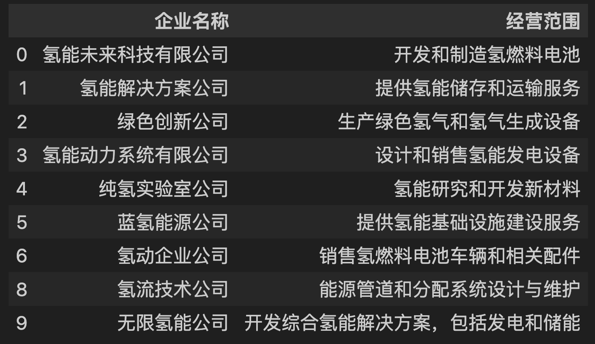
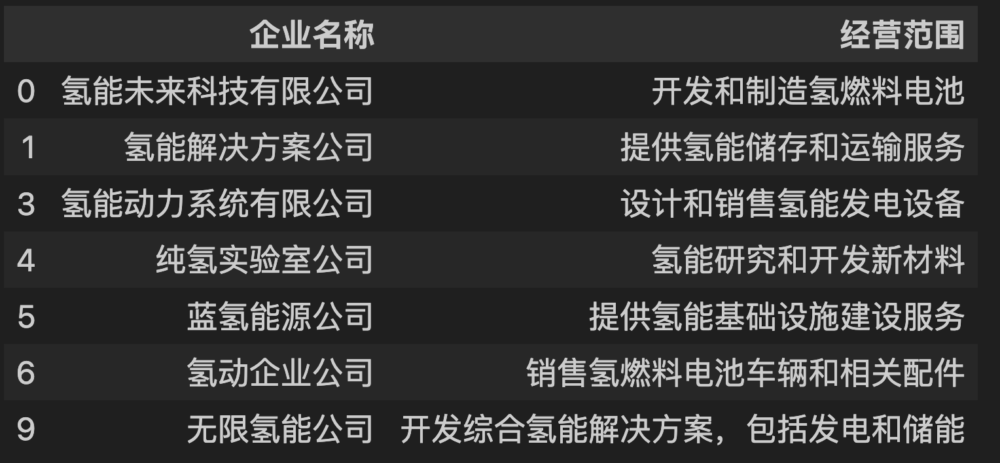

# pandas 根据关键词进行筛选

## 背景

最近一段时间在做企业分类的实验，给定一个企业信息表，利用关键词从**企业名称**和**经营范围**中筛选相关企业。

情况一：**企业名称**和**经营范围**任何一个包含关键词；
情况二：**企业名称**和**经营范围**同时都包括关键词；

## 实战

以下述虚假的企业信息表为例子，完成上述关键词任务的筛选

```python
companies_info = [
    ["氢能未来科技有限公司", "开发和制造氢燃料电池"],
    ["氢能解决方案公司", "提供氢能储存和运输服务"],
    ["绿色创新公司", "生产绿色氢气和氢气生成设备"],
    ["氢能动力系统有限公司", "设计和销售氢能发电设备"],
    ["纯氢实验室公司", "氢能研究和开发新材料"],
    ["蓝氢能源公司", "提供氢能基础设施建设服务"],
    ["氢动企业公司", "销售氢燃料电池车辆和相关配件"],
    ["生态公司", "绿色能源生产及其工业应用"],
    ["氢流技术公司", "能源管道和分配系统设计与维护"],
    ["无限氢能公司", "开发综合氢能解决方案，包括发电和储能"]
]
```

```python
df = pd.DataFrame(companies_info, columns=["企业名称","经营范围"])
```

### 情况一

**企业名称**和**经营范围**任何一个包含关键词；

```python
def filter_by_keyword1(df_: pd.DataFrame, cols: Union[list, str], keyword: str) -> pd.DataFrame:
    if isinstance(cols, str):
        cols = [cols]
    idx = pd.Series([False] * len(df_))
    for col in cols:
        idx = idx | df_[col].str.contains(keyword, na=False)
    return df_[idx]
```

```python
filter_by_keyword1(df, ["企业名称", "经营范围"], "氢")
```
下述筛选出的企业，企业名称和经营范围，任何一个包含“氢”都会被筛选出来。



也可以只查看**企业名称**或**经营范围**包含关键词的企业：

```python
filter_by_keyword1(df, "企业名称", "氢")
```

```python
filter_by_keyword1(df, "经营范围", "氢")
```

### 情况二

**企业名称**和**经营范围**同时都包括关键词；

```python
def filter_by_keyword2(
    df_: pd.DataFrame, cols: Union[list, str], keyword: str) -> pd.DataFrame:
    if isinstance(cols, str):
        cols = [cols]
    for col in cols:
        df_ = df_[df_[col].str.contains(keyword, na=False)]
    return df_
```
可以注意到``filter_by_keyword2`与`filter_by_keyword1`的写法不同。

`filter_by_keyword1`：每次都保留Bool值的下标；
`filter_by_keyword2`：由于是“与”操作，每次根据Bool值下标筛选一遍企业，可以减少后续过滤的计算量；

```python
filter_by_keyword2(df, ["企业名称", "经营范围"], "氢")
```

**企业名称**或**经营范围** 必须同时包含“氢”才会被筛选出来。



