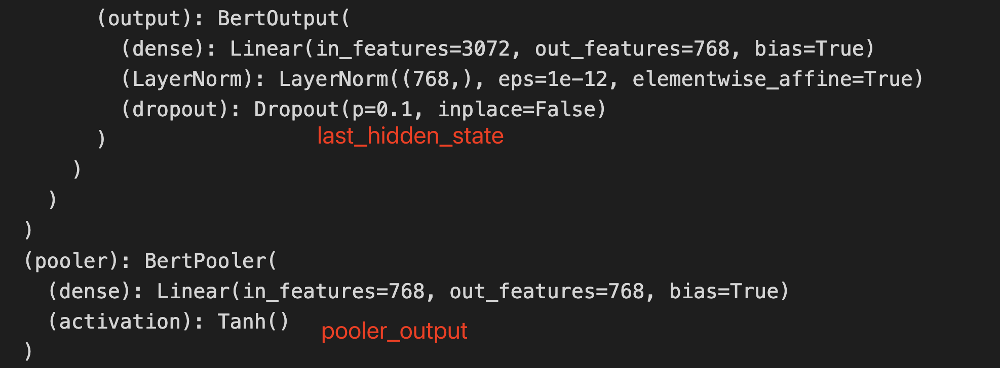

# Bert文本分类和命名实体的模型架构剖析

## 介绍

文本分类：给一句文本分类；
实体识别：从一句文本中，识别出其中的实体；

> 做命名实体识别，有2种方式：
> 1. 基于Bert-lstm-crf 的Token分类；
> 2. 生成式的从序列到序列的文本生成方法。比如：T5、UIE、大模型等；

如果你想体验完整命名实体识别教程请浏览：Huggingface Token 分类官方教程：[https://huggingface.co/learn/nlp-course/zh-CN/chapter7/2](https://huggingface.co/learn/nlp-course/zh-CN/chapter7/2)。

若实体识别采取Token分类的做法：
&emsp;那么文本分类是给一整句话做分类，实体识别是给一整句话中的每个词做分类。从本质上看，两者都是分类任务；

```python
import torch
from transformers import (
    AutoTokenizer, 
    AutoModel,
    AutoModelForSequenceClassification,
    BertForSequenceClassification,
    AutoModelForTokenClassification,
)
```

## Bert模型架构

基本的Bert模型结构：

```python
model_name = "bert-base-chinese"
bert = AutoModel.from_pretrained(model_name)
bert
```
Output:

```python
...
        (output): BertOutput(
          (dense): Linear(in_features=3072, out_features=768, bias=True)
          (LayerNorm): LayerNorm((768,), eps=1e-12, elementwise_affine=True)
          (dropout): Dropout(p=0.1, inplace=False)
        )
      )
    )
  )
  (pooler): BertPooler(
    (dense): Linear(in_features=768, out_features=768, bias=True)
    (activation): Tanh()
  )
)
```

文本分类模型：

```python
seq_cls_model = AutoModelForSequenceClassification.from_pretrained(model_name)
seq_cls_model
```
Output:

```python
...
          (output): BertOutput(
            (dense): Linear(in_features=3072, out_features=768, bias=True)
            (LayerNorm): LayerNorm((768,), eps=1e-12, elementwise_affine=True)
            (dropout): Dropout(p=0.1, inplace=False)
          )
        )
      )
    )
    (pooler): BertPooler(
      (dense): Linear(in_features=768, out_features=768, bias=True)
      (activation): Tanh()
    )
  )
  (dropout): Dropout(p=0.1, inplace=False)
  (classifier): Linear(in_features=768, out_features=2, bias=True)
)
```

实体识别 token 分类：

```python
token_cls_model = AutoModelForTokenClassification.from_pretrained(model_name)
token_cls_model
```

Output:

```python
...
          (output): BertOutput(
            (dense): Linear(in_features=3072, out_features=768, bias=True)
            (LayerNorm): LayerNorm((768,), eps=1e-12, elementwise_affine=True)
            (dropout): Dropout(p=0.1, inplace=False)
          )
        )
      )
    )
  )
  (dropout): Dropout(p=0.1, inplace=False)
  (classifier): Linear(in_features=768, out_features=2, bias=True)
)
```

经过观察`AutoModelForSequenceClassification` 和 `AutoModelForTokenClassification`的模型架构一模一样，即分类与实体识别的模型架构一模一样。两者都是在基础的Bert模型尾部添加 `dropout`和 `classifier`层。

> Q：它们是一模一样Bert模型架构，为何能实现不同的任务？
> A：因为它们选取Bert输出不同，损失值计算也不同。

## 损失计算方式

### BertForSequenceClassification

```python
from transformers import BertForSequenceClassification
```

> 按住 Ctrl + 鼠标左键，查看源码

在 `forward` 函数中可以查看到loss的计算方式。

```python
outputs = self.bert(
    input_ids,
    attention_mask=attention_mask,
    token_type_ids=token_type_ids,
    position_ids=position_ids,
    head_mask=head_mask,
    inputs_embeds=inputs_embeds,
    output_attentions=output_attentions,
    output_hidden_states=output_hidden_states,
    return_dict=return_dict,
)

pooled_output = outputs[1]

pooled_output = self.dropout(pooled_output)
logits = self.classifier(pooled_output)
```

BertForSequenceClassification 使用 `pooled_output = outputs[1]`。

### BertForTokenClassification

```python
from transformers import BertForTokenClassification
```

> 在 `forward` 函数中可以查看到loss的计算方式。

```python
...
outputs = self.bert(
    input_ids,
    attention_mask=attention_mask,
    token_type_ids=token_type_ids,
    position_ids=position_ids,
    head_mask=head_mask,
    inputs_embeds=inputs_embeds,
    output_attentions=output_attentions,
    output_hidden_states=output_hidden_states,
    return_dict=return_dict,
)

sequence_output = outputs[0]

sequence_output = self.dropout(sequence_output)
logits = self.classifier(sequence_output)
```

BertForTokenClassification 使用 `sequence_output = outputs[0]`。

## Bert 输出结果剖析

下述是`BertModel`的输出结果，既可以使用字典访问，也可以通过下标访问:

```python
BaseModelOutputWithPoolingAndCrossAttentions(
            last_hidden_state=sequence_output,
            pooler_output=pooled_output,
            past_key_values=encoder_outputs.past_key_values,
            hidden_states=encoder_outputs.hidden_states,
            attentions=encoder_outputs.attentions,
            cross_attentions=encoder_outputs.cross_attentions,
        )
```

`outputs[0]` 是last_hidden_state， `outputs[1]`是 pooler_output。

last_hidden_state 是输入到Bert模型每一个token的状态，`pooler_output`是`[CLS]`的last_hidden_state经过pooler处理得到的状态。



> 在图片上，用红色字标出了 last_hidden_state 和 pooler_output 在模型架构的位置。

### 例子

接下来使用一个例子帮助各位读者深入理解Bert输出结果中的`last_hidden_state`和`pooler_output`的区别。

```python
from transformers import (
    AutoTokenizer, 
    # BertModel,
    AutoModel,
    DataCollatorForTokenClassification
)
model_name = "bert-base-chinese"
tokenizer = AutoTokenizer.from_pretrained(model_name)
seq_cls_model = AutoModel.from_pretrained(model_name)

data_collator = DataCollatorForTokenClassification(tokenizer=tokenizer)
batch = data_collator([
                        tokenizer("今天天气真好，咱们出去放风筝吧！"),
                        tokenizer("起风了，还是在家待着吧！"),
                        ])
```

```python
for k, v in batch.items():
    print(k, v.shape)
```

Output:

```python
input_ids torch.Size([2, 18])
token_type_ids torch.Size([2, 18])
attention_mask torch.Size([2, 18])
```

Bert 模型推理
```python
output = bert(**batch)
print(
    torch.equal(output[0], output["last_hidden_state"]),
    torch.equal(output[1], output["pooler_output"])
)
last_hidden_state = output["last_hidden_state"]
pooler_output = output["pooler_output"]
```

Output:

```python
True True
# output[0] == output["last_hidden_state"] 为真
# 这意味着Bert的输出，既可以用下标访问，也可以用字典的键访问
```


```python
print(
    f"last_hidden_state.shape: {last_hidden_state.shape}",
    f"pooler_output.shape: {pooler_output.shape}"
)
```

Output:

```python
last_hidden_state.shape: torch.Size([2, 18, 768]) pooler_output.shape: torch.Size([2, 768])
```

> 仅仅看它们的shape，也能看出它们的区别

last_hidden_state：包括每一个token的状态；（所以用来做命名实体识别）
pooler_output：只有[CLS]的状态；（[CLS]的输出向量被认为是整个序列的聚合表示，故用于分类任务。）

```python
# [CLS] 在第一个token的位置，通过下标获取 `[CLS]`的tensor，再经过pooler处理
# 判断其与output["pooler_output"]是否相等
CLS_tensor = last_hidden_state[:,0,:].reshape(2, 1, -1)
torch.equal(
    bert.pooler(CLS_tensor),
    pooler_output
)
```

Output:

```python
True
```

输出为True，这验证了  `[CLS]`的tensor经过pooler层后，便是output["pooler_output"]。

## 参考资料

* Huggingface Token 分类官方教程：[https://huggingface.co/learn/nlp-course/zh-CN/chapter7/2](https://huggingface.co/learn/nlp-course/zh-CN/chapter7/2#Token%20%E5%88%86%E7%B1%BB) 若你想使用Bert做命名实体识别，非常推荐浏览这篇官方教程