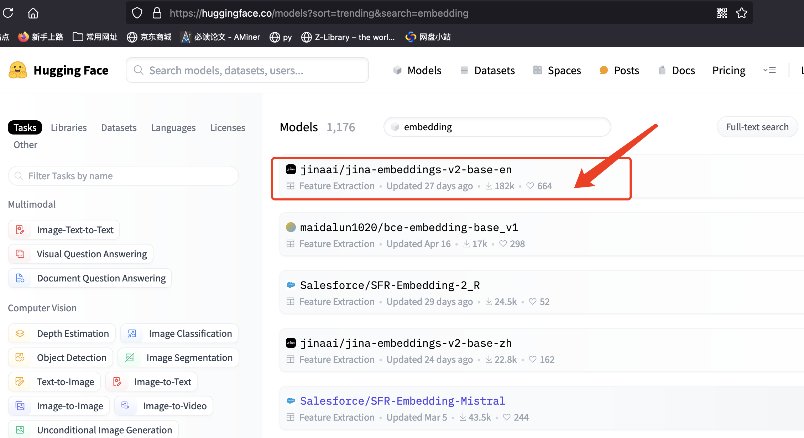
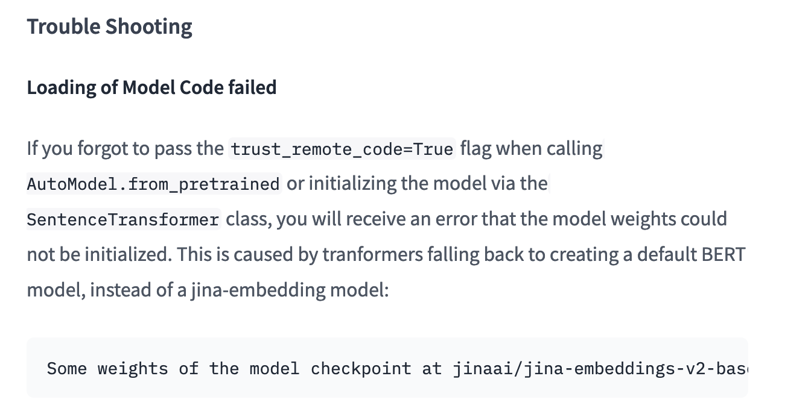
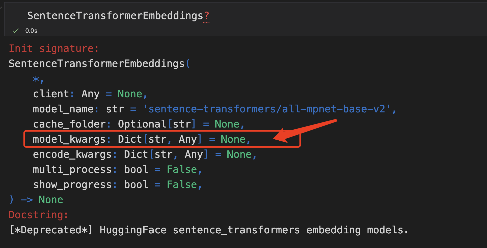
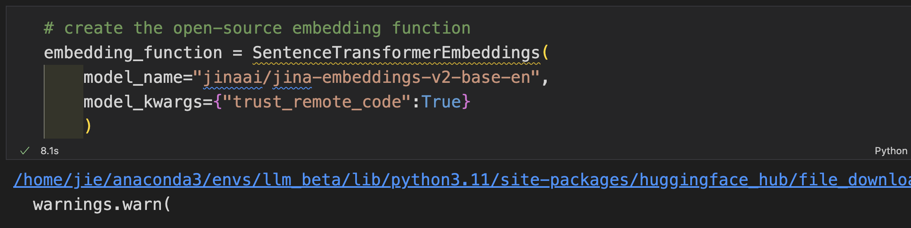

## 摘要

使用 `{"trust_remote_code":True}` 传递给 langchain_community.embeddings 的 SentenceTransformerEmbeddings ，逐步解析 `jinaai/jina-embeddings-v2-base-en` 编码模型初始化加载异常的问题。

## 背景

首先先说一下，最近的研究方向，想构建一个向量数据库，做一些RAG和相似文本筛选方面的实验。

接下来，我们来看看 LangChain 官方给的示例代码。

[https://python.langchain.com/v0.2/docs/integrations/vectorstores/chroma/](https://python.langchain.com/v0.2/docs/integrations/vectorstores/chroma/)

```python
# import
from langchain_chroma import Chroma
from langchain_community.document_loaders import TextLoader
from langchain_community.embeddings.sentence_transformer import (
    SentenceTransformerEmbeddings,
)
from langchain_text_splitters import CharacterTextSplitter

# load the document and split it into chunks
loader = TextLoader("../../how_to/state_of_the_union.txt")
documents = loader.load()

# split it into chunks
text_splitter = CharacterTextSplitter(chunk_size=1000, chunk_overlap=0)
docs = text_splitter.split_documents(documents)

# create the open-source embedding function
embedding_function = SentenceTransformerEmbeddings(model_name="all-MiniLM-L6-v2")

# load it into Chroma
db = Chroma.from_documents(docs, embedding_function)

# query it
query = "What did the president say about Ketanji Brown Jackson"
docs = db.similarity_search(query)

# print results
print(docs[0].page_content)
```

官方使用的是 `all-MiniLM-L6-v2` 编码模型。笔者并不想用这个模型，在[https://huggingface.co/models?sort=trending&search=embedding](https://huggingface.co/models?sort=trending&search=embedding)上搜索"embedding"关键词。



[jina-embeddings-v2-base-en](https://huggingface.co/jinaai/jina-embeddings-v2-base-en) 排在第一位，有182k的下载量，故笔者想使用这个模型作为向量编码模型。

加载模型：

```python
# create the open-source embedding function
embedding_function = SentenceTransformerEmbeddings(model_name="jinaai/jina-embeddings-v2-base-en")
```

Output:

```python
No sentence-transformers model found with name jinaai/jina-embeddings-v2-base-en. Creating a new one with mean pooling.
Some weights of BertModel were not initialized from the model checkpoint at jinaai/jina-embeddings-v2-base-en and are newly initialized: ['embeddings.position_embeddings.weight', 'encoder.layer.0.intermediate.dense.bias', 'encoder.layer.0.intermediate.dense.weight', 'encoder.layer.0.output.LayerNorm.bias', 'encoder.layer.0.output.LayerNorm.weight', 'encoder.layer.0.output.dense.bias', 'encoder.layer.0.output.dense.weight', 'encoder.layer.1.intermediate.dense.bias', 'encoder.layer.1.intermediate.dense.weight',       
                                             ......                                         'encoder.layer.8.output.dense.bias', 'encoder.layer.8.output.dense.weight', 'encoder.layer.9.intermediate.dense.bias', 'encoder.layer.9.intermediate.dense.weight', 'encoder.layer.9.output.LayerNorm.bias', 'encoder.layer.9.output.LayerNorm.weight', 'encoder.layer.9.output.dense.bias', 'encoder.layer.9.output.dense.weight']
You should probably TRAIN this model on a down-stream task to be able to use it for predictions and inference.
```

在加载`jinaai/jina-embeddings-v2-base-en`模型的时候，提醒我们很多层的权重，**重新初始化**了，必须要引起重视。如果你忽视了这个报错，你会得到的错误的结果。

> Tips:
>
> 其实一开始我也没有重视，忽视了这个报错，因为我自认为参考LangChain官方的代码，可以不用理会这个报错。
> 后果就是，模型每次重新初始化，权重都会变化，导致得到的编码向量不一致，这才让我引起重视，不得不解决这个问题。

那么笔者是如何解决这个问题的呢？

通过浏览 [https://huggingface.co/jinaai/jina-embeddings-v2-base-en](https://huggingface.co/jinaai/jina-embeddings-v2-base-en) 的说明文档，发现在文档中早有说明了。



通过浏览上述的说明，解决方法就是在加载模型时，传入 `trust_remote_code=True` 。

可以看到 LangChain 的 SentenceTransformerEmbeddings 接收一个 model_kwargs 字典参数。我都不用看源码，就能想到 model_kwargs 会传递给模型进行初始化。



```python
# create the open-source embedding function
embedding_function = SentenceTransformerEmbeddings(
    model_name="jinaai/jina-embeddings-v2-base-en",
    model_kwargs={"trust_remote_code":True}
    )
```

运行上述代码，传入`{"trust_remote_code":True}` 就不会报警告了。



接下来的部分，大家就可以浏览 LangChain 上的教程，进行进一步的学习了。

## 附录

若无法连接 huggingface，可尝试使用 proxy：

> 只需运行下述代码，与huggingface的连接，就会走proxy

```python
import os
os.environ['HTTP_PROXY'] = 'http://127.0.0.1:7890'
os.environ['HTTPS_PROXY'] = 'http://127.0.0.1:7890'
```


## 参考资料

* LangChain 官方Chroma构建示例教程：[https://python.langchain.com/v0.2/docs/integrations/vectorstores/chroma/](https://python.langchain.com/v0.2/docs/integrations/vectorstores/chroma/)
