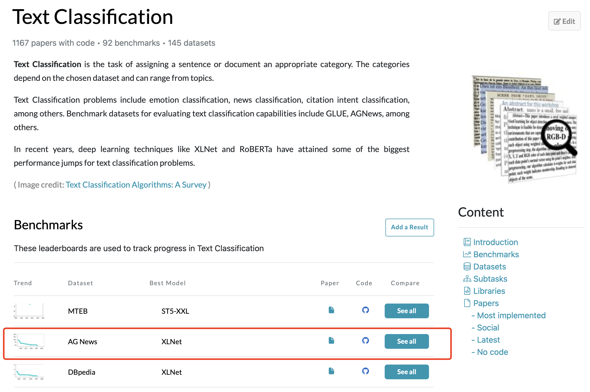

@[toc]


## 简介

本文记录了使用 vllm 部署 GLM4-9B-Chat 模型进行 Zero-Shot 文本分类的实验过程与结果。通过对 AG_News 数据集的测试，研究发现大模型在直接进行分类时的准确率为 77%。然而，让模型给出分类原因描述（reason）后，准确率显著提升至 83%，提升幅度达 6%。这一结果验证了引入 reasoning 机制的有效性。文中详细介绍了实验数据、提示词设计、模型推理方法及评估手段。


复现自这篇论文：[Text Classification via Large Language Models. https://arxiv.org/abs/2305.08377](https://arxiv.org/abs/2305.08377) 让大模型使用reason。


## 数据集

现在要找一个数据集做实验，进入 [https://paperswithcode.com/](https://paperswithcode.com/)。
找到 文本分类，看目前的 SOTA 是在哪些数据集上做的，[文本分类. https://paperswithcode.com/task/text-classification](https://paperswithcode.com/task/text-classification)



实验使用了 AG_News 数据集。若您对数据集操作技巧感兴趣，可以参考这篇文章：

[datasets库一些基本方法：filter、map、select等. https://blog.csdn.net/sjxgghg/article/details/141384131](https://blog.csdn.net/sjxgghg/article/details/141384131)


## 实验设置

在 `settings.py` 文件中，我们定义了一些实验中使用的提示词：

```python
LABEL_NAMES = ['World', 'Sports', 'Business', 'Science | Technology']

BASIC_CLS_PROMPT = """
你是文本分类专家，请你给下述文本分类，把它分到下述类别中：
* World
* Sports
* Business
* Science | Technology

text是待分类的文本。请你一步一步思考，在label中给出最终的分类结果：
text: {text}
label: 
"""

REASON_CLS_PROMPT = """
你是文本分类专家，请你给下述文本分类，把它分到下述类别中：
* World
* Sports
* Business
* Science | Technology

text是待分类的文本。请你一步一步思考，首先在reason中说明你的判断理由，然后在label中给出最终的分类结果：
text: {text}
reason: 
label: 
""".lstrip()

data_files = [
    "data/basic_llm.csv",
    "data/reason_llm.csv"
]

output_dirs = [
    "output/basic_vllm.pkl",
    "output/reason_vllm.pkl"
]
```

这两个数据文件用于存储不同提示词的大模型推理数据：

- `data/basic_llm.csv`
- `data/reason_llm.csv`


## 数据集转换

为了让模型能够执行文本分类任务，我们需要对原始数据集进行转换，添加提示词。

原始的数据集样式，要经过提示词转换后，才能让模型做文本分类。

代码如下：

`data_processon.ipynb`

```python
from datasets import load_dataset

from settings import LABEL_NAMES, BASIC_CLS_PROMPT, REASON_CLS_PROMPT, data_files

import os
os.environ['HTTP_PROXY'] = 'http://127.0.0.1:7890'
os.environ['HTTPS_PROXY'] = 'http://127.0.0.1:7890'

# 加载 AG_News 数据集的测试集，只使用test的数据去预测
ds = load_dataset("fancyzhx/ag_news")

# 转换为 basic 提示词格式
def trans2llm(item):
    item["text"] = BASIC_CLS_PROMPT.format(text=item["text"])
    return item
ds["test"].map(trans2llm).to_csv(data_files[0], index=False)

# 转换为 reason 提示词格式
def trans2llm(item):
    item["text"] = REASON_CLS_PROMPT.format(text=item["text"])
    return item
ds["test"].map(trans2llm).to_csv(data_files[1], index=False)
```

上述代码实现的功能就是把数据集的文本，放入到提示词的`{text}` 里面。


## 模型推理

本文使用 [ZhipuAI/glm-4-9b-chat. https://www.modelscope.cn/models/zhipuai/glm-4-9b-chat](https://www.modelscope.cn/models/zhipuai/glm-4-9b-chat) 智谱9B的chat模型，进行VLLM推理。

为了简化模型调用，我们编写了一些实用工具：

`utils.py`

```python
import pickle
from transformers import AutoTokenizer
from vllm import LLM, SamplingParams
from modelscope import snapshot_download


def save_obj(obj, name):
    """
    将对象保存到文件
    :param obj: 要保存的对象
    :param name: 文件的名称（包括路径）
    """
    with open(name, "wb") as f:
        pickle.dump(obj, f, pickle.HIGHEST_PROTOCOL)


def load_obj(name):
    """
    从文件加载对象
    :param name: 文件的名称（包括路径）
    :return: 反序列化后的对象
    """
    with open(name, "rb") as f:
        return pickle.load(f)
    


def glm4_vllm(prompts, output_dir, temperature=0, max_tokens=1024):
    # GLM-4-9B-Chat-1M
    max_model_len, tp_size = 131072, 1
    model_dir = snapshot_download('ZhipuAI/glm-4-9b-chat')

    tokenizer = AutoTokenizer.from_pretrained(model_dir, trust_remote_code=True)
    llm = LLM(
        model=model_dir,
        tensor_parallel_size=tp_size,
        max_model_len=max_model_len,
        trust_remote_code=True,
        enforce_eager=True,
    )
    stop_token_ids = [151329, 151336, 151338]
    sampling_params = SamplingParams(temperature=temperature, max_tokens=max_tokens, stop_token_ids=stop_token_ids)

    inputs = tokenizer.apply_chat_template(prompts, tokenize=False, add_generation_prompt=True)
    outputs = llm.generate(prompts=inputs, sampling_params=sampling_params)

    save_obj(outputs, output_dir)
```


`glm4_vllm` :

* 参考自 https://www.modelscope.cn/models/zhipuai/glm-4-9b-chat

  > 给大家封装好了，以后有任务，直接调用函数


`save_obj`:

* 把python对象，序列化保存到本地；

  在本项目中，用来保存 vllm 推理的结果；


**模型推理代码** ：

```python
from datasets import load_dataset

from utils import glm4_vllm
from settings import data_files, output_dirs


# basic 预测
basic_dataset = load_dataset(
    "csv",
    data_files=data_files[0],
    split="train",
)
prompts = []
for item in basic_dataset:
    prompts.append([{"role": "user", "content": item["text"]}])
glm4_vllm(prompts, output_dirs[0])


# reason 预测，添加了原因说明
reason_dataset = load_dataset(
    "csv",
    data_files=data_files[1],
    split="train",
)
prompts = []
for item in reason_dataset:
    prompts.append([{"role": "user", "content": item["text"]}])
glm4_vllm(prompts, output_dirs[1])


# nohup python cls_vllm.py > cls_vllm.log 2>&1 &
```


在推理过程中，我们使用了 `glm4_vllm` 函数进行模型推理，并将结果保存到指定路径。

`output_dirs`:  最终推理完成的结果输出路径；

## 评估

在获得模型推理结果后，我们需要对其进行评估，以衡量分类的准确性。

`eval.ipynb`

```python
from settings import LABEL_NAMES
from utils import load_obj

from datasets import load_dataset
from settings import data_files, output_dirs

import os
os.environ['HTTP_PROXY'] = 'http://127.0.0.1:7890'
os.environ['HTTPS_PROXY'] = 'http://127.0.0.1:7890'

ds = load_dataset("fancyzhx/ag_news")
```


```python
def eval(raw_dataset, vllm_predict):
    
    right = 0 # 预测正确的数量
    multi_label = 0 # 预测多标签的数量
    
    for data, output in zip(raw_dataset, vllm_predict):
        true_label = LABEL_NAMES[data['label']]
        
        output_text = output.outputs[0].text
        pred_label = output_text.split("label")[-1]
        
        tmp_pred = []
        for label in LABEL_NAMES:
            if label in pred_label:
                tmp_pred.append(label)
        
        if len(tmp_pred) > 1:
            multi_label += 1
        
        if " ".join(tmp_pred) == true_label:
            right += 1
    
    return right, multi_label
```

我们分别对 basic 和 reason 预测结果进行了评估。

basic 预测结果的评估 ：

```python
dataset = load_dataset(
    'csv', 
    data_files=data_files[0], 
    split='train'
    )
output = load_obj(output_dirs[0])

eval(dataset, output)
```

输出结果：

```python
(5845, 143)
```


加了reason 预测结果评估：

```python
dataset = load_dataset(
    'csv', 
    data_files=data_files[1], 
    split='train'
    )
output = load_obj(output_dirs[1])

eval(dataset, output)
```

输出结果：

```python
(6293, 14)
```


评估结果如下：

- **basic:** 直接分类准确率为 77%（5845/7600），误分类为多标签的样本有 143 个。
- **reason:** 在输出原因后分类准确率提高至 83%（6293/7600），多标签误分类样本减少至 14 个。

> 误分类多标签:  这是单分类问题，大模型应该只输出一个类别，但是它输出了多个类别；


可以发现，让大模型输出reason，其分类准确率提升了5%。

在误分类多标签的数量也有所下降。原先误分类多标签有143条数据，使用reason后，多标签误分类的数量降低到了14条。

这些结果表明，让模型输出 reason的过程，确实能够有效提升分类准确性，并减少误分类多个标签的情况。
