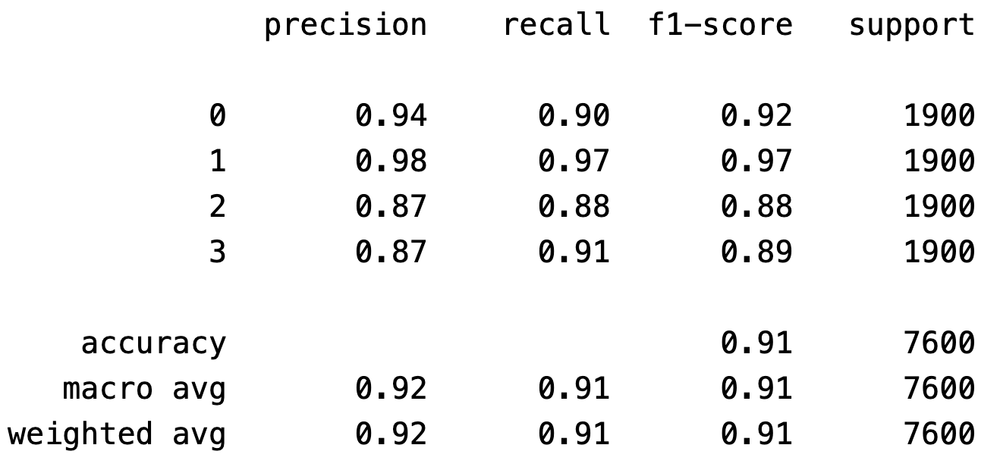
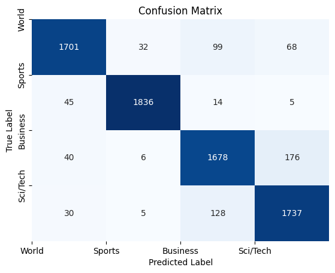

# BERT 多分类实战

## 项目介绍

使用 transformers.Trainer 自动训练模型，使用训练完成的模型进行预测，评估模型训练的效果。

## 准备工作

在开始动手前，我们需要准备以下内容：

1. **必要的库**：`transformers`（Hugging Face提供的BERT库）、`torch`（PyTorch框架）、`sklearn`（常用的机器学习工具库）

2. **数据集**：为了演示，我们使用一个包含新闻文本的多分类数据集。每条新闻需要被分类为``['World', 'Sports', 'Business', 'Sci/Tech']``等类别。

   ```python
   dataset = load_dataset("fancyzhx/ag_news")
   ```

## 数据预处理

该数据集为英文数据集，故使用`bert-base-uncased` 模型。

```python
model_name = "bert-base-uncased"

tokenizer = AutoTokenizer.from_pretrained(model_name)

def tokenize_func(tokenizer):

    def _func(item):
        return tokenizer(
            item["text"],
            max_length=512,
            truncation=True,
        )

    return _func

new_dataset = dataset.map(tokenize_func(tokenizer=tokenizer))
```

## 训练

构建基于BERT的多分类模型。Hugging Face的`transformers`库提供了预训练的BERT模型，并且我们可以很方便地在这个基础上微调。

```python
bert = AutoModelForSequenceClassification.from_pretrained(
    model_name,
    trust_remote_code=True,
    num_labels=4,
)
```

在这里，我们使用了`BertForSequenceClassification`，它是一个预训练的BERT模型，同时包含一个序列分类头，用于文本分类任务。

```python
args = TrainingArguments(
    output_dir=output_dir,
    evaluation_strategy="epoch",
    save_strategy="epoch",
    save_total_limit=3,
    learning_rate=2e-5,
    num_train_epochs=epoch,
    weight_decay=0.01,
    per_device_train_batch_size=32,
    per_device_eval_batch_size=16,
    # logging_steps=16,
    save_safetensors=True,
    overwrite_output_dir=True,
    load_best_model_at_end=True,
)

self.trainer = Trainer(
    model=self.model,
    args=args,
    train_dataset=self.train_dataset,
    eval_dataset=self.eval_dataset,
    data_collator=self.data_collator,
    compute_metrics=self.compute_metrics,
    tokenizer=tokenizer,
)
```

使用了`Trainer`来简化训练流程，定义了训练的相关参数，比如训练轮次、batch size等。

## 评估

在测试集上的评估如下所示：

```python
from sklearn.metrics import classification_report, confusion_matrix
```

使用 `classification_report` 评估模型的预测情况。



\[注]: support 代表数据样本的数量。

使用 `confusion_matrix` 计算混淆矩阵。最后在测试集上，预测的混淆矩阵如下所示，利用 `confusion_matrix`计算混淆矩阵。

 

探索机器学习中的混淆矩阵（Confusion Matrix）

在多分类问题中，模型评估是非常重要的环节，混淆矩阵（Confusion Matrix）作为一种直观的评估工具，被广泛应用于分类问题。

混淆矩阵是一个 `n x n` 的矩阵，其中 `n` 是分类任务中的类别数量。它展示了模型在每个分类上的**真实标签**和**预测标签**的分布情况。矩阵的每一行代表实际的类，列代表模型预测的类。

**对角线元素**表示模型**正确分类**的数量，它们表示真实类别和预测类别完全一致的样本数。

因此它直观展示出了每个类别的分类情况，帮助我们识别模型在不同类别上的表现差异。

## 开源

项目代码：

## 总结

在这篇文章中，展示了如何基于BERT进行多分类任务的完整流程。从数据预处理到模型训练再到评估。

接下来，你可以尝试用其他数据集来训练你的模型，甚至调整BERT的预训练模型或使用不同的超参数进行微调。无论是文本分类、情感分析，还是其他NLP任务。